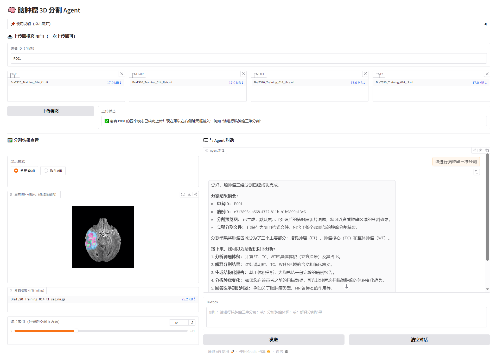
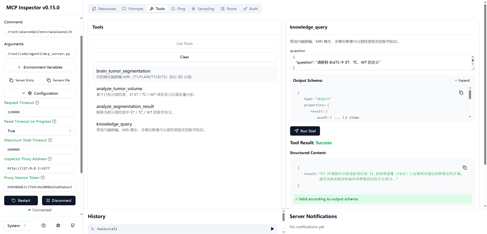

# 脑肿瘤影像辅助诊断 Agent

这是一个面向 **3D 脑肿瘤 MRI 多模态影像** 的智能分析系统，集成了 **病灶分割、体积定量分析、结构化报告生成、历史变化对比、医学知识问答** 等能力，旨在构建一个可交互、可追溯、可扩展的影像辅助分析 Agent。系统以 **SwinUNETR + RAG + Agent Memory** 为核心，围绕“**分割 → 分析 → 报告 → 问答 → 历史回溯**”形成完整闭环，为患者提供一个辅助诊断的医疗助手。

项目后端基于 **Python / PyTorch / MONAI / LangChain / DeepSeek / Faiss / MCP/ Gradio / Linux** 实现，支持多轮对话、患者级长期记忆、历史病例对比和知识增强型问答。系统不仅能够完成当前病例的肿瘤分割与定量分析，还能够结合患者历史体积分析结果与结构化报告摘要，提供更连续的变化趋势解读与结构化输出。



#### 常用提问方式

- 请进行脑肿瘤三维分割
- 帮我分析肿瘤体积
- 请生成一份结构化报告
- 帮我解释一下分割结果
- 帮我分析一下肿瘤变化
- 脑肿瘤常见治疗方案有哪些

## 一、MCP 支持

本项目将系统核心能力封装为 **MCP工具接口**，支持被外部智能体或 MCP 客户端标准化调用。



#### 已封装工具

- `brain_tumor_segmentation`  
  基于四模态 MRI（T1 / FLAIR / T1CE / T2）执行 3D 脑肿瘤分割，返回 `case_id`、分割结果路径、预览图路径及切片信息

- `analyze_tumor_volume`  
  基于分割结果，对 ET / TC / WT 的体积及占比进行定量分析

- `analyze_segmentation_result`  
  对分割结果中的 ET / TC / WT 区域进行语义解释

- `knowledge_query`  
  基于 RAG 医学知识库进行脑肿瘤相关知识检索与问答

#### 相关文件

- `brain_core.py`：核心业务逻辑（分割、分析、知识检索）
- `agent_tools.py`：LangChain 工具封装
- `mcp_server.py`：MCP Server 入口

#### 本地调试

- **启动 MCP Inspector：**

  `mcp dev mcp_server.py`

- **或直接启动 MCP Server：**
  `python mcp_server.py`

## 二、RAG 医学知识库

本项目构建 **医学知识库 + RAG 检索增强问答** ，用于支持：

- ET / TC / WT 区域解释
- T1 / T1CE / T2 / FLAIR 模态说明
- 脑肿瘤相关医学知识问答
- 分割结果的辅助解释

#### 具体设计

```text
用户问题
  ↓
router.py
  ├── rule_kb.py   # 固定知识（ET/TC/WT、MRI模态）
  └── rag_kb.py    # 开放知识问答
        ├── retriever.py   # FAISS + BM25 混合召回
        └── reranker.py    # bge-reranker 精排
```

#### 目录结构

```text
rag/
├── corpus/
├── rule_kb.py
├── build_index.py
├── bm25_index.py
├── retriever.py
├── reranker.py
├── rag_kb.py
└── router.py
```

#### 相关文件

1. **`rule_kb.py`**

基础知识库，基于本地字典与规则匹配实现，适合回答固定问题：

- ET / TC / WT 是什么
- MRI 上有什么表现
- 有什么临床意义
- T1 / T1CE / T2 / FLAIR 的作用

2. **`build_index.py`**

读取 `corpus/*.jsonl`，切分为 chunk，使用 `bge-m3` 向量化，并构建 `FAISS` 索引。

输出：

- `faiss.index`
- `chunks.json`
- `build_config.json`

3. **`bm25_index.py`**

基于 `chunks.json` 构建 BM25 索引。

输出：

- `bm25_index.pkl`
- `bm25_config.json`
- `tokenized_corpus.json`

4. **`retriever.py`**

混合召回模块：

- dense retrieval：`bge-m3 + FAISS`
- sparse retrieval：`BM25`
- 融合方式：`RRF`

5. **`reranker.py`**

使用 `bge-reranker-v2-m3` 对召回候选进行精排。

6. **`rag_kb.py`**

RAG 问答入口，负责：

- 检索
- 精排
- 拼接上下文
- 调用 LLM 生成答案

7. **`router.py`**

统一路由入口：

- 固定知识问题 → `rule_kb.py`
- 开放知识问题 → `rag_kb.py`

#### 建库流程

1. **构建向量索引**

`python build_index.py`

2. **构建 BM25 索引**

`python bm25_index.py`

## 三、记忆管理与报告生成

本项目构建了**短期记忆、长期记忆、报告生成**三部分能力，用于支持多轮对话、历史病例回溯、肿瘤变化分析与结构化输出。

#### 具体设计

```text
patient_id + 四模态上传
-> 脑肿瘤 3D 分割
-> 肿瘤体积分析
-> 结构化报告生成
-> 历史变化分析
-> 历史增强型知识问答
```

#### 短期记忆
- 短期记忆用于维护当前会话上下文，支持：
- 记住当前 `patient_id`、`case_id`
- 记住用户已上传的 T1 / FLAIR / T1CE / T2 四模态
- 支持“分割 → 体积分析 → 报告生成 → 变化分析”的连续交互

#### 长期记忆

长期记忆基于向量存储，按 `patient_id` 维护患者历史信息。当前仅保留两类核心记忆：

- `volume_analysis`：肿瘤体积分析结果  
- `structured_report`：结构化报告摘要  

长期记忆支持：

- 历史病例召回
- 历史报告摘要回顾
- 患者画像构建
- 肿瘤变化趋势分析
- 历史增强型知识问答

#### 报告生成
系统基于 `analyze_volume_core()` 的输出生成结构化报告，并直接在对话中返回。当前报告包含：

- 基本信息（patient_id / case_id / 生成时间 / 耗时）
- 摘要
- 定量分析（WT / TC / ET 体积与占比）
- 简要解读
- 结论 / 总结
- 免责声明

#### 相关文件

- `agent.py`：Agent 主逻辑与短期记忆管理
- `agent_tools.py`：工具注册与调用封装
- `brain_core.py`：分割、体积分析、报告生成、变化分析、知识问答入口
- `long_term_memory.py`：长期记忆管理与患者画像
- `report_generator.py`：报告组织与渲染

## 四、项目特点

- **多模态分割分析一体化**：支持四模态 MRI 输入与 3D 脑肿瘤分割
- **多轮对话式交互**：支持分割、分析、报告、问答连续使用
- **患者级历史管理**：支持按 `patient_id` 做长期记忆召回
- **历史变化分析**：支持当前病例与上一病例的体积变化比较
- **结构化报告输出**：支持直接在对话中生成并展示报告
- **知识增强型问答**：支持固定知识 + RAG 开放知识双路由
